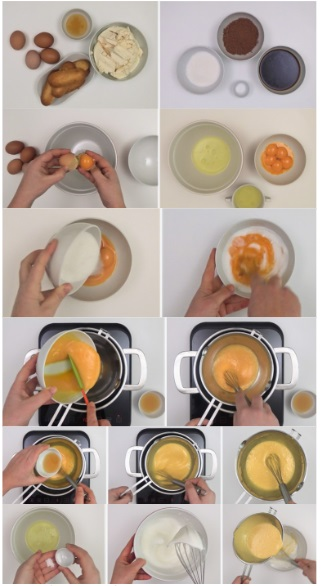
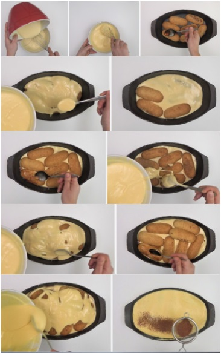

# *Tiramisú*. Receta italiana

   

> El tiramisú es uno de los postres italianos más conocidos y apreciados del mundo: ¡piensa que Tiramisú es la quinta palabra italiana más conocida entre los europeos.

> Alrededor de la historia del tiramisú se escuchan muchas leyendas. Una de ellas la encontramos en la Toscana y cuenta que el tiramisú se inventó en Siena debido a la visita del Gran Duque Cosimo III De Medici: en ese momento el postre se llamaba «sopa de duque».
>

_Para 8 personas_

## Ingredientes

Considerar aumentar la cantidad dependiendo del numero de personas 

| *Ingrediente*            | *Cantidad*     | | *Ingrediente*            | *Cantidad*     | |
| ----------------- | :---------------: | :---------------: |:---------------: |:---------------: |:---------------: |
| Queso-Crema Mascarpone      | 500g.  |  |    Huevo  |  6 piezas.  |  |
| Azúcar Glass en Polvo        | 150 g. |  | Bizcochos Savoiardi o de Soletilla      | 300 g. |  |
| Amaretto | 4 cucharadas |  | Café Fuerte       | 150 ml. |  |
| Cacao puro en polvo       | 10 a 20 g.  |  | Sal      | 1 Pizca |  |

## Preparación de la crema sabayón

> 1. Calentamos agua en una cazuela grande, debe estar caliente pero sin llegar a hervir. Mientras se calienta el agua vamos separando las yemas de las claras y apartamos en una taza. Las claras las vamos a montar posteriormente, reservamos.
>
> 2. Los huevos deben ser frescos y hay que manipularlos a temperatura ambiente. Mezclamos el azúcar, en un cuenco metálico, con todas las yemas. Empezamos batiendo en el cuenco fuera del agua y cuando comience a espumar introducimos el cuenco en la cazuela con el agua caliente.
>
> 3. Una vez dentro batimos con unas varillas manualmente o con las de la batidora hasta que las yemas doblen de tamaño. Vamos añadiendo poco a poco las cuatro cucharadas de amaretto y mezclando de manera envolvente hasta que estén incorporadas a la crema. Después de mezclar todo sacamos del baño maría y seguimos en frío hasta que nos quede una crema esponjosa y compacta. Reservamos para el montaje del tiramisú.

## Preparación del tiramisú casero

> 1. Montamos las claras a punto de nieve. Para ello introducimos las claras, a temperatura ambiente, en un bol en el que no haya ningún resto de grasa o no subirán. Les añadimos un pellizco de sal y empezamos a batir. Batimos hasta que las claras suban y queden firmes. Luego manejamos el merengue con una espátula de silicona.
>
> 2. Añadimos la crema sabayón que tenemos reservada a las claras montadas. Mezclamos de manera envolvente y con cuidado hasta que quede todo integrado e intentando que bajen lo mínimo posible.
>
> 3. Batimos el queso mascarpone hasta que quede cremoso (lo mejor es batirlo a temperatura ambiente). Mezclamos este queso batido con la crema anterior suavemente, intentando que no se baje la crema para mantenerla esponjosa. Reservamos.
>
> 4. Ponemos una cafetera con un buen café, el que más nos guste. Una vez preparado lo dejaremos enfriar.
>

## Presentación final del tiramisú

> 1. En el molde elegido, ponemos una capa de bizcochos de soletilla. Regamos con el café para empapar los bizcochos. No debemos mojarlos demasiado, lo justo para asustarlos, no deben romperse.  
>
> 2. Cubrimos con una capa de crema de queso y huevo y repetimos la operación hasta tener una o dos capas más, bizcochos mojados y capa de crema. El último paso es el del toque del cacao, imprescindible que sea cacao de calidad y amargo. Este ingrediente es el que da ese contraste tan importante en este postre.
>
> 3. Lo espolvoreamos sobre el postre con un colador para que no queden grumillos. Yo suelo dejar este paso para el final de todo. Justo antes de presentarlo a los invitados, porque al enfriar el cacao tiene peor presentación. Y lo fundamental, metedlo a la nevera para que enfríe. Yo lo dejo siempre de un día para otro.
>

### _Si tienes dudas puedes ver nuestro video_

